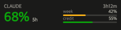
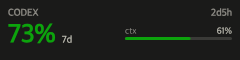

# AI Tokens — FlexDesigner プラグイン

Claude Code と Codex CLI の**残りクォータ**を Flexbar のキー上に常時表示する FlexDesigner プラグインです。




- **Claude キー** — 5時間枠の残量を大きく表示。週次枠と追加クレジットをメーターで併記
- **Codex キー** — 主レート制限枠の残量を表示。コンテキスト使用量をメーターで併記
- 残量に応じて色が変化（緑 → 黄 → オレンジ → 赤）。**色だけに頼らず数値も常に表示**します
- キーを**クリックすると即時更新**
- リセットまでの残り時間を右上に表示

---

## ⚠️ 重要: Claude 側は非公式 API を使用しています

このプラグインは Claude の残量取得に `https://api.anthropic.com/api/oauth/usage` を使用します。

- これは **Anthropic の公開 API リファレンスに記載されていないエンドポイント**です。Claude Code 自身が `/usage` の表示に使っているものと同じで、コミュニティによって発見されました
- **Anthropic の仕様変更により予告なく壊れる可能性があります**
- レート制限が厳しいため、更新間隔は **60秒以上**を強く推奨します（デフォルト120秒）

**なぜこの方法しかないのか:** `~/.claude/projects/**/*.jsonl` に記録されるのは「消費した」トークン数のみで、レート制限枠やリセット時刻の情報が一切含まれません。そのため、正確な**残量**を知る手段が他に存在しません。

一方 **Codex 側はローカルファイルの読み取りのみ**で、認証もネットワークアクセスも不要です。

### トークンの取り扱い

- Claude の OAuth トークンは macOS では **Keychain**（`Claude Code-credentials`）、Linux / Windows では `~/.claude/.credentials.json` から読み取ります
- トークンは **Anthropic への認証にのみ使用**し、ログ・設定ファイル・キーの描画内容には一切出力しません
- **第三者への送信は行いません**

---

## 動作環境

| 要件 | バージョン |
|---|---|
| FlexDesigner | 2.0.1 以降 |
| Node.js | 20 以降 |
| Claude Code | ログイン済みであること（Claude キーを使う場合） |
| Codex CLI | 1回以上セッションを実行済みであること（Codex キーを使う場合） |

macOS / Windows / Linux に対応しています。

---

## インストール

### リリースからインストール（推奨）

1. [Releases](https://github.com/ShotaArima/plugin-FlexDesigner-tokens/releases) から、自分の OS / アーキテクチャに合った `.flexplugin` をダウンロード
2. FlexDesigner の **Key Library** からインポート

### ソースからビルド

```bash
git clone https://github.com/ShotaArima/plugin-FlexDesigner-tokens.git
cd plugin-FlexDesigner-tokens
npm install
npm run build
npm run plugin:pack       # com.arishow.aitokens.flexplugin が生成される
```

---

## 開発

### Nix を使う場合（推奨）

このリポジトリは flake で開発環境を固定しています。

```bash
nix develop          # direnv を使うなら `direnv allow` だけで有効化されます
npm install
npm run dev          # FlexDesigner を起動した状態で実行してください
```

Nix が未導入の場合は Determinate Systems インストーラが簡単です:

```bash
curl --proto '=https' --tlsv1.2 -sSf -L https://install.determinate.systems/nix | sh -s -- install
```

`flake.nix` は Node.js 20 / git / jq を提供し、npm のグローバル prefix をリポジトリ内（`.npm-global`）に閉じ込めるため、`flexcli` がシステム全体を汚しません。

### Nix を使わない場合

Node.js 20 以降があれば `npm install && npm run dev` で動きます。

### 主なコマンド

| コマンド | 内容 |
|---|---|
| `npm run build` | バックエンドを `backend/plugin.cjs` にバンドル |
| `npm run dev` | リンク + ウォッチ + デバッグ（FlexDesigner 起動中に実行） |
| `npm run plugin:validate` | manifest と構造を検証 |
| `npm run plugin:pack` | `.flexplugin` を生成 |

### 構成

```
src/
  plugin.js              SDK のイベント配線・ポーリング・バックオフ
  render.js              @napi-rs/canvas によるキー描画（240×60）
  providers/
    claude.js            OAuth usage エンドポイント（要認証・要ネットワーク）
    codex.js             ~/.codex/sessions の rollout JSONL を読み取り
com.arishow.aitokens.plugin/
  manifest.json          キー定義・多言語リソース（en / ja）
  ui/*.vue               設定画面（Vue 3 + Vuetify 3）
```

---

## リリース

`manifest.json` の `version` と一致するタグを push すると、GitHub Actions が
3 OS 分の `.flexplugin` をビルドして Release に添付します。

```bash
git tag v0.1.0
git push origin v0.1.0
```

---

## トラブルシューティング

| 表示 | 原因と対処 |
|---|---|
| `Claude credentials not found` | `claude` を実行してログインしてください |
| `Claude auth rejected (401)` | トークンが失効しています。`claude` を再実行してください |
| `Rate limited by usage API (429)` | 更新間隔を長くしてください（60秒以上推奨） |
| `No Codex sessions found` | Codex CLI を1回以上実行してください |
| `No rate limit data in recent Codex sessions` | Codex で1ターン以上やり取りしてください |
| キー右上に `·stale` | 更新に失敗し、直近の取得値を表示しています |

---

## ライセンス

[MIT](LICENSE) © ShotaArima

このプロジェクトは Anthropic、OpenAI、EniacTech のいずれとも関係のない非公式なものです。
